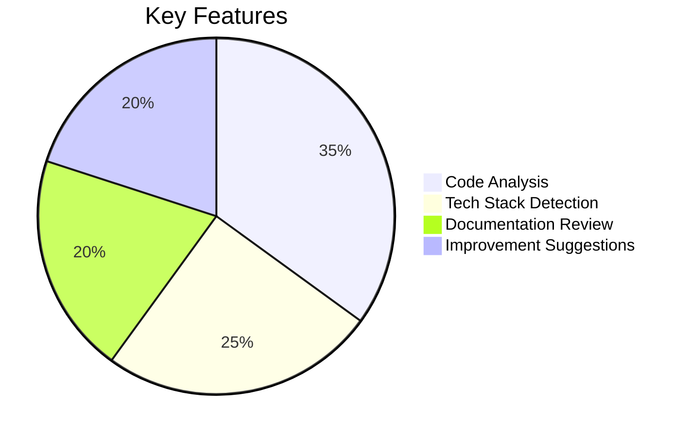
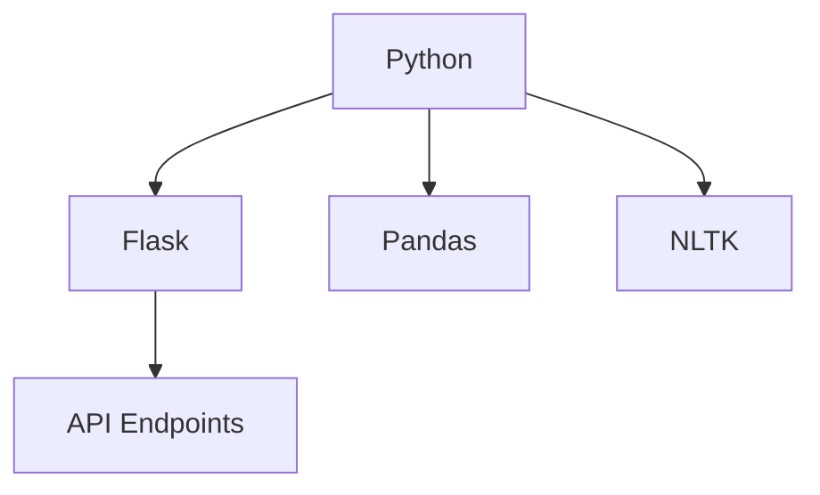

# 🚀 DevInsight Agent - GitHub Repository Analyzer


<div align="center">
  
[](https://github.com/yourusername/DevInsight-Agent/stargazers)
[](https://www.python.org/)
[](LICENSE)

</div>

## 🌟 Features

<div align="center">
  


</div>

- 🔍 **Deep Code Analysis** with LLaMA 3.2:1b
- 📊 **Technology Stack Visualization**
- 🐛 **Bug & Smell Detection**
- 📝 **Auto-Generated Documentation**
- 🚀 **Performance Optimization Tips**
- 💻 **100% Offline Operation**

## 🛠️ Tech Stack

<div align="center">
  
| Component        | Technology                          |
|------------------|-------------------------------------|
| **LLM Engine**   | LLaMA 3.2:1b (Local)               |
| **Backend**      | Python 3.8+                        |
| **Web Interface**| Streamlit                          |
| **Repo Handling**| GitPython                          |
| **Visualization**| Mermaid.js, Plotly                 |

</div>

## 🎯 Quick Start

### Prerequisites
```bash
curl -fsSL https://ollama.com/install.sh | sh
ollama pull llama3:2b  # LLaMA 3.2:1b variant
```

### Installation
```bash
git clone https://github.com/yourusername/DevInsight-Agent.git
cd DevInsight-Agent
pip install -r requirements.txt
```

### Usage
#### CLI Version
```bash
python main.py https://github.com/username/repository.git
```

#### Web Interface
```bash
streamlit run app.py
```


## 📊 Sample Report Output

```markdown
# DevInsight Analysis Report

## 🔍 Repository Overview
**Project**: WriteWiseAI  
**Analysis Date**: 2023-11-15  
**Total Files**: 142  
**Code Files**: 87  

## 🧩 Technology Stack


## 🚨 Potential Issues
1. **Security**: Found 3 hardcoded API keys
2. **Performance**: Unoptimized database queries in `data_processor.py`
3. **Documentation**: 62% of functions lack docstrings

## 💡 Recommendations
✅ Implement environment variables for configuration  
✅ Add pagination to large database queries  
✅ Write unit tests for core modules  
```

## 🏗️ Project Structure

```bash
.
├── agent/                # Core analysis modules
│   ├── cloner.py         # Repository cloning
│   ├── analyzer.py       # Code analysis engine
│   └── reporter.py       # Report generation
├── prompts/              # LLM prompt templates
├── app.py                # Streamlit web interface
├── main.py               # CLI interface
└── config.py             # Configuration settings
```

## 🌈 Visualization Features

1. **Interactive Tech Stack Graphs**
   ```python
   import plotly.express as px
   fig = px.sunburst(language_data, path=['language', 'framework'])
   st.plotly_chart(fig)
   ```

2. **Code Health Dashboard**
   

3. **Real-time Analysis Progress**
   ```python
   with st.status("Analyzing repository...", expanded=True) as status:
       analyze_code()
       status.update(label="Analysis complete!", state="complete")
   ```

## 📜 License
MIT © 2023 [Your Name]

---

<div align="center">
  
[](https://buymeacoffee.com/yourusername)
[](https://twitter.com/yourhandle)

</div>
```

### Key Visual Enhancements:

1. **Animated Banner**: Add a GIF showing the tool in action
2. **Mermaid Diagrams**: For tech stack visualization
3. **Interactive Badges**: GitHub stars, Python version, etc.
4. **Progress Animations**: For the web interface
5. **Sample Report Visualization**: With code blocks and diagrams
6. **Sunburst Charts**: For language/framework breakdowns

### Implementation Notes:

1. Create an `assets/` folder for images/GIFs
2. Add actual screenshots of your interface
3. For the LLaMA 3.2:1b implementation:
   ```python
   # In config.py
   MODEL_NAME = "llama3:2b"  # 2B parameter version
   MODEL_VERSION = "3.2:1b"  # Specific variant
   ```

Would you like me to add any specific visualization examples or create actual image assets for your project?
